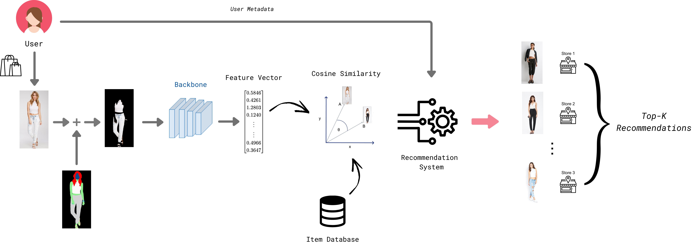

# Trend-Aware Fashion Recommendation with Visual Segmentation and Semantic Similarity


## 🔍 Project Overview

This system builds on the [DeepFashion](https://mmlab.ie.cuhk.edu.hk/projects/DeepFashion.html)[[1]](#1) dataset of over 800K garment images (with pixel-level annotations), using both the raw photos and their corresponding segmentation masks. We apply color-code masking to strip away non-garment pixels (hair, skin, background), isolating only clothing regions. Those masked images are fed through a choice of pretrained CNN backbones (ResNet50[[2]](#2), DenseNet121[[3]](#3), VGG16[[3]](#3)), modified to output fixed-length feature embeddings rather than classification scores. All item vectors are stored in an indexable database.

A modular, end-to-end fashion recommendation engine that:

- **Extracts visual features** from garment images using pretrained CNN backbones (ResNet50, DenseNet121, VGG16).
- **Applies color-based segmentation** to isolate garment pixels, improving feature relevance.
- **Simulates customer behavior** by generating synthetic purchase histories influenced by item popularity and personal style trends.
- **Computes personalized recommendations** using a fused relevance score combining visual similarity, popularity, category affinity, and geolocation.

This repository is ideal for experimentation with content-based recommendation, synthetic data pipelines, and prototyping retail-use cases.

<figure style="text-align: center;">
  
  <figcaption style="margin-top: 8px; font-style: italic;">Overview of the proposed Recommendation System.</figcaption>
</figure>


---

## 🚀 Key Features

- **Pluggable Backbones**: Easily switch or extend CNN architectures; identity layers replace final classifiers to produce embedding vectors.
- **Segmentation Masking**: Filter out non-garment pixels (hair, skin, background) via color-coded masks.
- **Metadata Parsing**: Extracts `gender`, `category`, and `item_id` from standardized filenames using regex patterns.
- **Synthetic Data Engine**:
  - Configurable number of users and purchase frequencies.
  - Trendy vs. popular item selection modeled per user.
  - Time-stamped purchase events over a defined period.
- **Recommendation Scoring**:
  - **Visual Similarity**: Cosine similarity of feature embeddings.
  - **Popularity Adjustment**: Dynamic item popularity normalized and penalized according to user trendiness.
  - **Category Affinity**: Manual group-based similarity matrix.
  - **Geographical Context**: Haversine-distance-based[[5]](#5) store proximity scoring.

---

## 🛠️ Installation & Setup

1. **Clone the repository**
   ```bash
   git clone https://github.com/meddjilani/FashionRecommender.git
   cd FashionRecommender
   ```

2. **Create a Python environment**
   ```bash
   python3 -m venv venv
   source venv/bin/activate
   ```

3. **Install dependencies**
   ```bash
   pip install -r req.txt
   ```

4. **Prepare data folders**
   - Place training images in `data/train_images/`
   - Place segmentation masks in `data/segmentation/`

---

## ⚙️ Configuration

All parameters can be configured via command-line flags or environment variables:

| Flag                             | Default                  | Description                                                  |
|----------------------------------|--------------------------|--------------------------------------------------------------|
| `--seed`                         | `42`                     | Random seed for reproducibility                              |
| `--num_customers`                | `15`                     | Number of synthetic users                                    |
| `--max_purchases_per_customer`   | `3`                      | Max (average) purchases per user                             |
| `--top_k`                        | `10`                     | Number of recommendations per purchased item                 |
| `--P_max`                        | `100`                    | Initial max popularity count                                 |
| `--P_threshold`                  | `0.15`                   | Popularity threshold ratio                                   |
| `--Penalty_exponent`             | `4`                      | Exponent controlling pop. penalty sensitivity                |
| `--train_folder`                 | `data/train_images`      | Path to raw images                                           |
| `--seg_folder`                   | `data/segmentation`      | Path to segmentation masks                                   |

Run the pipeline with:
```bash
python final_recommandation.py --num_customers 10 --top_k 5
```

---

## 📁 Project Structure

```
fashion-recommender/
├── data/
│   ├── train_images/                 # Raw fashion item images
│   └── segmentation/                 # Color-coded masks
│
├── utils/
│   ├── saved_items_data.pkl          # Cached metadata
│   ├── saved_features_<backbone>.pt  # Cached embeddings per backbone
│   ├── data.csv                      # Generated synthetic purchase history
│   └── popularity_dict.pkl           # Item popularity state
│
├── final_recommandation.py           # Entry point: orchestrates extraction, simulation, recommendations
│
├── req.txt                           # Python dependencies
├── README.md                         # (this file)
└── results/                          # Output recommendations (.csv)
```


---

## 🔧 Customization & Extension

- **Add new backbones**: Extend `get_model()` in `extraction.py`.
- **Adjust similarity logic**: Modify `category_similarity()` or weighting in `main.py`.
- **Integrate real data**: Replace synthetic simulation with actual purchase logs.
- **Deploy as a service**: Wrap recommendations in a REST API (e.g., FastAPI).


## References
<a id="1">[1]</a> 
Liu, Z., Luo, P., Qiu, S., Wang, X., & Tang, X. (2016). DeepFashion: Powering robust clothes recognition and retrieval with rich annotations. In Proceedings of the IEEE Conference on Computer Vision and Pattern Recognition (CVPR) (pp. 1096–1104).

<a id="2">[2]</a> 
Kaiming He, Xiangyu Zhang, Shaoqing Ren, and Jian Sun. 2016. Deep residual learning for image recognition. In Proceedings of the IEEE conference on computer vision and pattern recognition. 770–778.

<a id="3">[3]</a> 
Gao Huang, Zhuang Liu, Laurens Van Der Maaten, and Kilian Q Weinberger. 2017. Densely connected convolutional networks. In Proceedings of the IEEE conference on computer vision and pattern recognition. 4700–4708.

<a id="4">[4]</a> 
Karen Simonyan and Andrew Zisserman. 2014. Very deep convolutional networks for large-scale image recognition. arXiv preprint arXiv:1409 1556 (2014)

<a id="5">[5]</a> 
P.N. Ruane. 2014. Heavenly mathematics: the forgotten art of spherical trigonometry by Glen Van Brummelen, pp 192, £24.95, ISBN 978-0-691-14892-2, Princeton University Press (2013). The Mathematical Gazette 98 (11 2014), 561–562. doi:10.1017/S0025557200008573

## 📜 License

This project is licensed under the [MIT License](LICENSE).
